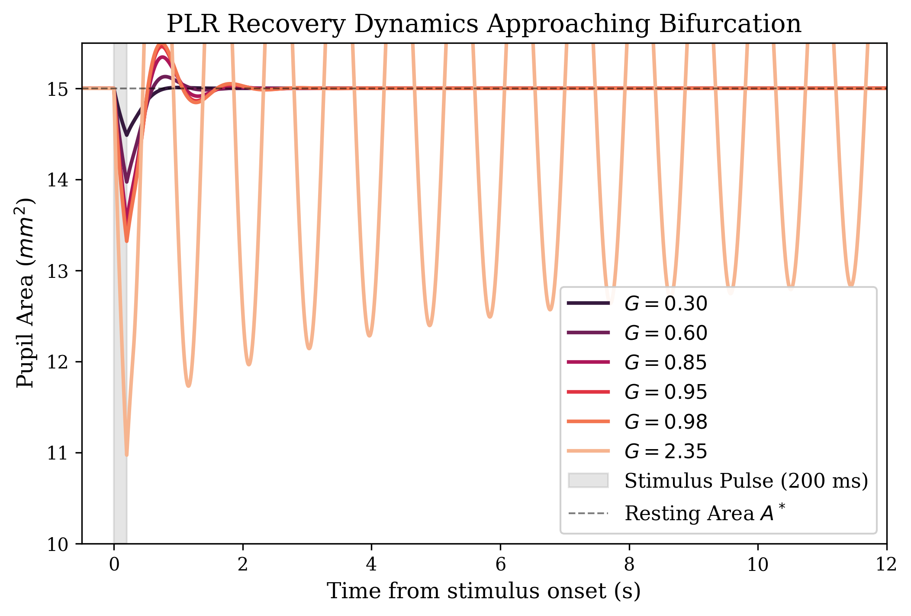
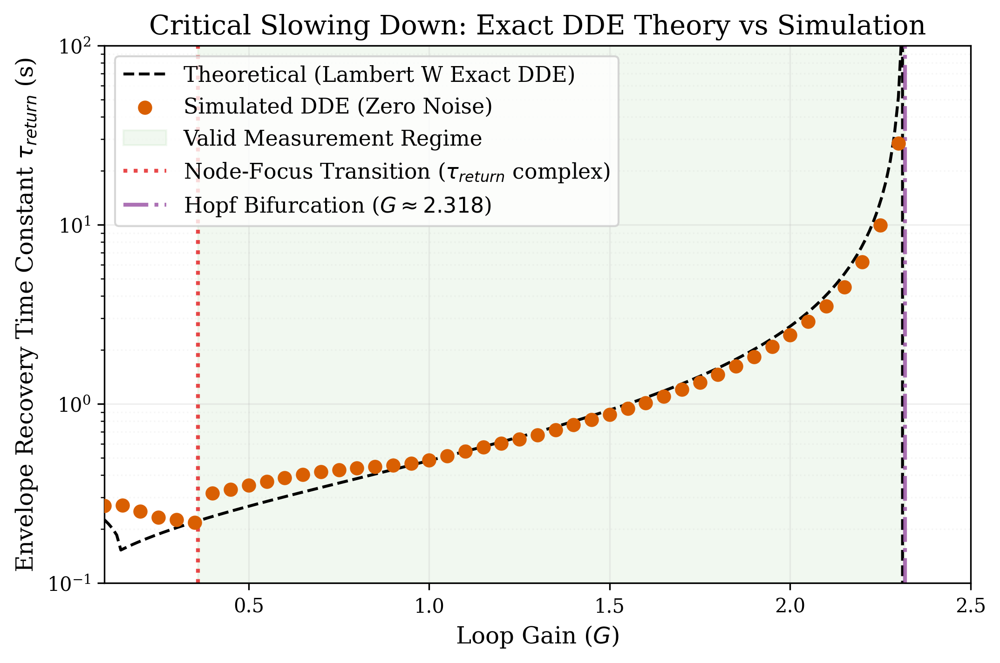
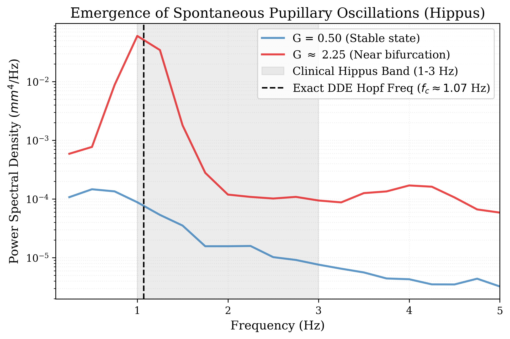
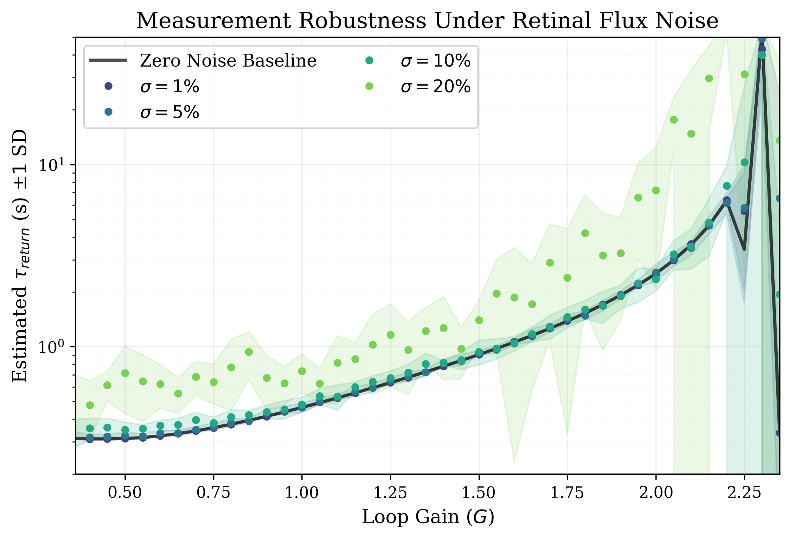

# Critical Slowing Down in the Pupillary Light Reflex
### A Computational Framework for Non-Invasive Locus Coeruleus Arousal Estimation

A high-fidelity simulation of the human Pupillary Light Reflex (PLR) as a **nonlinear delayed negative-feedback control system**, grounded in the Longtin–Milton (1989) Delay-Differential Equation. The project computationally validates a novel method for estimating **Locus Coeruleus (LC) tonic arousal state** from dynamical pupillometry — without any invasive procedure.

---

## The Problem

Standard clinical pupillometry treats the pupil as a static tape measure: *how wide is it?*

This completely discards the dynamical structure of the reflex. The **Locus Coeruleus (LC)** — the brain's primary noradrenergic nucleus — directly modulates the gain `G` of the pupil's reflexive control loop via its sympathetic projections to the iris dilator. This creates a direct mapping:

| Brain State | LC Tonic Output | Loop Gain `G` | Pupil Recovery |
|---|---|---|---|
| Hyperarousal / stress | High | Low | Fast, overdamped |
| Focused / alert | Moderate | Moderate | Normal |
| Fatigue / drowsiness | Low | High | Slow, underdamped ringing |
| At bifurcation | Very low | `→ 2.318` | Spontaneous oscillations (Hippus) |

As `G` increases toward the critical Hopf threshold `G_c ≈ 2.318` (computed from the exact DDE characteristic equation with `τ_iris = 0.311 s` and `δ = 0.300 s`), the system approaches a **Hopf bifurcation**, producing two measurable phenomena:

1. **Critical Slowing Down (CSD):** The exponential recovery time constant `τ_return` diverges — recovery becomes progressively slower and develops underdamped oscillatory ringing
2. **Hippus:** Spontaneous ~1 Hz pupillary oscillations emerge as a stable limit cycle, bounded to finite amplitude by the Hill function nonlinearity

By measuring `τ_return` from a standardized 200 ms light pulse and inverting the exact DDE analytical relationship (via the Lambert W function), the underlying LC gain state `G` — and thus arousal level — can be recovered continuously and non-invasively.

---

## Key Results

### Figure 1 — Critical Slowing Down in the Time Domain
An identical 200 ms light pulse produces dramatically different recovery trajectories depending on `G`. Five representative gain values are shown (`G = 0.30, 0.60, 0.85, 0.95, 2.35`). At low gain the pupil snaps back immediately with overdamped dynamics. As `G` increases through the valid measurement regime, recovery slows by orders of magnitude and the trace develops underdamped oscillatory ringing. At `G = 2.35` — beyond the Hopf boundary — the system enters a sustained limit-cycle oscillation and does not return to equilibrium.



---

### Figure 2 — Recovery Time Constant vs. Loop Gain
The exact analytical Lambert W solution of the DDE characteristic equation (dashed line) precisely predicts the nonlinear DDE simulation results (orange dots). The **Valid Measurement Regime** spans from the Node-Focus Transition (`G ≈ 0.36`, where the dominant eigenvalue acquires an imaginary part and the system becomes underdamped) to the Hopf Bifurcation (`G ≈ 2.318`, where the real part of the eigenvalue crosses zero and stability is lost). This defines the precise operating envelope of a non-invasive LC monitoring device.



---

### Figure 3 — Spectral Emergence of Hippus
Welch power spectral density computed from 60-second simulated traces with ambient retinal noise (`σ = 5%`). Two conditions are compared: a stable baseline at `G = 0.50` and a near-bifurcation state at `G = 0.97 · G_c ≈ 2.25`. Near the bifurcation, a clear spectral peak emerges within the clinical hippus band (1–3 Hz), centred at the exact DDE Hopf frequency `f_c ≈ 1.07 Hz` — matching the imaginary part of the critical eigenvalue. The Hill function nonlinearity bounds the growing instability into a finite-amplitude stable limit cycle, replicating the spectral signature of true biological hippus.



---

### Figure 4 — Noise Robustness
The Hilbert envelope extraction algorithm accurately tracks `τ_return` under realistic levels of retinal flux noise (`σ` = 1%, 5%, 10%, 20%). The zero-noise simulation baseline (black curve) is overlaid for comparison. Variance grows modestly with noise amplitude but the underlying critical-slowing-down trend is preserved across the full measurement regime, supporting the feasibility of ambulatory wearable deployment.



---

## Mathematical Model

The governing equation is the **nonlinear Longtin–Milton DDE**:

```
τ_iris · dA/dt = −A(t) + A* + γ · [ f(Φ(t−δ)) − f(A*) ]
```

where the retinal flux `Φ(t−δ) = A(t−δ) · (1 + s(t−δ))` incorporates both the delayed pupil area and the delayed stimulus, and `f(Φ)` is the Hill function negative feedback.

| Symbol | Meaning | Value |
|---|---|---|
| `A(t)` | Pupil area | mm² |
| `A*` | Resting equilibrium area | 15.0 mm² |
| `Φ(t−δ)` | Delayed retinal light flux | `A(t−δ) · (1 + s(t−δ))` |
| `f(Φ) = c·θⁿ / (θⁿ + Φⁿ)` | Hill saturating negative feedback | `n=4, θ=15, c=30` |
| `γ = G / \|f′(A*)\|` | Gain scaling factor | — |
| `G` | Effective linearized loop gain at equilibrium | dimensionless |
| `δ` | Neural conduction delay (afferent + efferent) | 0.300 s |
| `τ_iris` | Iris smooth-muscle time constant | 0.311 s |

The gain scaling `γ = G / |f′(A*)|` ensures that the **linearized** dynamics around equilibrium have exactly loop gain `G`, so that the Lambert W analytical theory applies precisely to small perturbations, while the full Hill nonlinearity governs the large-signal behaviour (limit cycles, saturation).

### Analytical Recovery Time Constant

The linearized DDE characteristic equation `λ + 1/τ_iris + (G/δ)·exp(−λδ) = 0` is solved exactly via the **Lambert W function**:

```
λ = W₀(−G·δ/τ_iris · exp(δ/τ_iris)) / δ  −  1/τ_iris
```

The envelope recovery time constant is then:

```
τ_return(G) = −1 / Re(λ)
```

This replaces the classical simplified approximation `τ ≈ τ_iris/(1−G)`, which assumed zero delay and positive-feedback topology, and incorrectly placed the bifurcation at `G = 1`. The exact DDE analysis yields `G_c ≈ 2.318` for the parameters above.

---

## Adaptive Stimulus Protocol

Inter-pulse intervals (IPI) are set adaptively to `5 · τ_pred(G)` (minimum 2.0 s), ensuring the pupil recovers to within 1% of `A*` before each subsequent pulse. `τ_pred` is computed from the Lambert W eigenvalue before each simulation, so the protocol self-adjusts across the full gain range.

---

## Project Structure

| File | Description |
|---|---|
| `prl_model.py` | Nonlinear DDE model with Hill function saturation and ring-buffer delay line |
| `stimulus.py` | Adaptive pulse protocol generator with Lambert W–derived IPI scaling |
| `analysis.py` | Hilbert envelope extraction, Lambert W τ-estimation, hippus detection (Welch PSD) |
| `main.py` | Full parameter sweep across G ∈ [0.10, 2.35] and five noise levels |
| `figures.py` | Publication-quality figure generation (Figures 1–4) |

---

## Installation & Usage

```bash
pip install -r requirements.txt
```

```bash
# Step 1: Run the parameter sweep and generate simulation traces
python main.py

# Step 2: Render figures from simulation data
python figures.py
```

All outputs (figures + CSVs) are saved to the `output/` directory. Pre-rendered figures are committed to `figures/`.

---

## References

- Longtin, A. & Milton, J.G. (1989). *Modelling autonomous oscillations in the human pupil light reflex using nonlinear delay-differential equations.* Bulletin of Mathematical Biology, 51(5), 605–624.
- Longtin, A. & Milton, J.G. (1989). *Insight into the transfer function, gain, and oscillation onset for the pupil light reflex using nonlinear delay-differential equations.* Biological Cybernetics, 61(1), 51–58.
- Aston-Jones, G. & Cohen, J.D. (2005). *An integrative theory of locus coeruleus-norepinephrine function.* Annual Review of Neuroscience, 28, 403–450.
